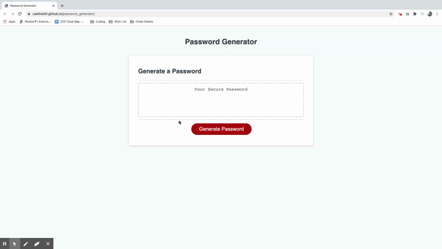

# password_generator

## Description:

When you open the page you will see the button 'generate password'.  Once that button is clicked you will receive a prompt asking about the number or characters you want for your password.  After that selection is made you will receive a series of prompts asking for the following information: lowercase letters, uppercase letters, numbers, and special character symbols.  The program will then take your submissions and generate a password.  The final password will appear in the text area and is ready for the user.

---
## Deployed page:

 https://usethehill.github.io/password_generator/

---
## Demo of page:

---
## Programs used:

- JavaScript
- HTML
- CSS